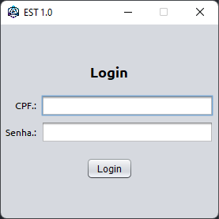
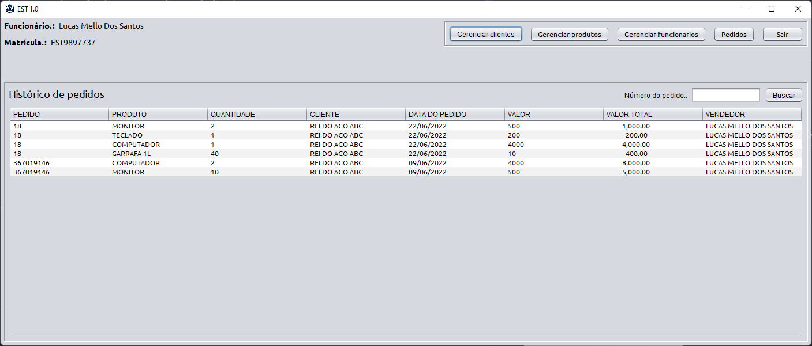
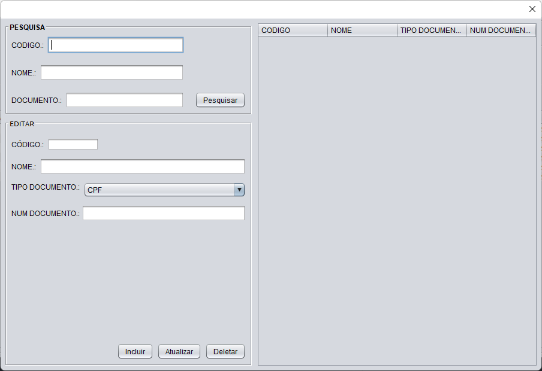
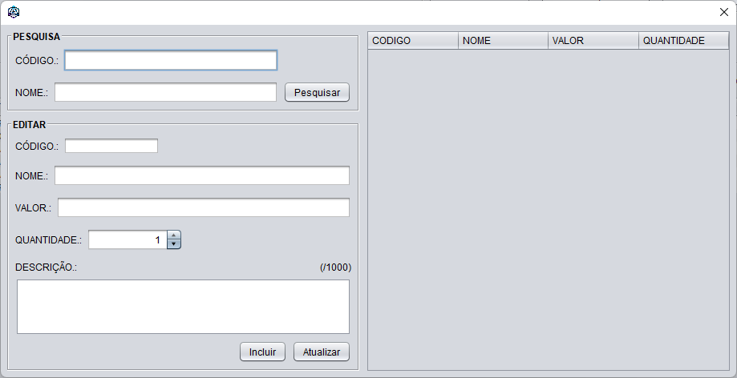
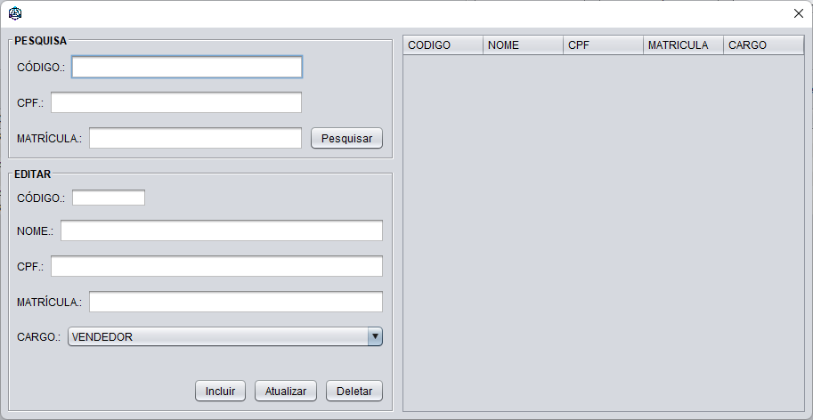
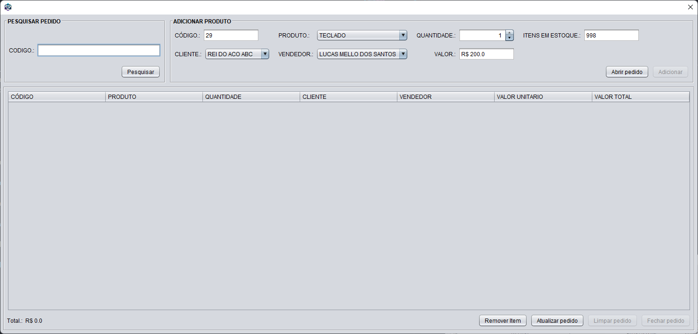
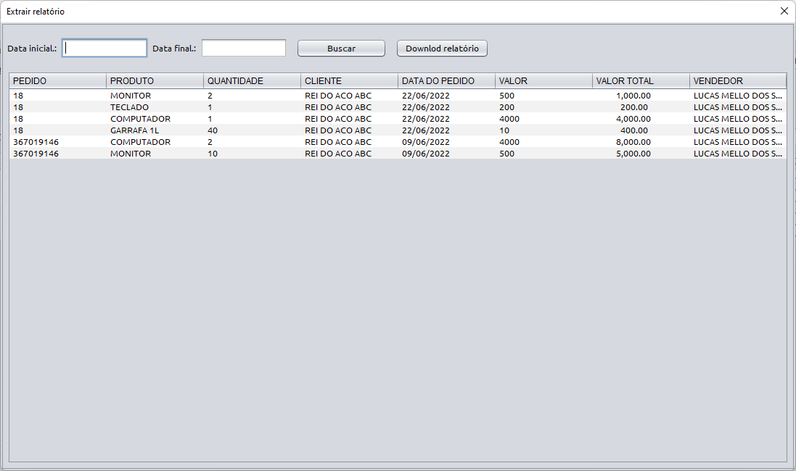

# EST

    

Essa aplicação foi desenvolvida com o objetivo de permitir o controle de um estoque, e conta com gerenciamento de funcionários, clientes, produtos e pedidos, além da possibilidade de extrair relatórios de saldo de estoque e histórico de vendas. Foi desenvolvido em Java, Java Swing e o banco de dados utilizado foi Oracle. A aplicação foi desenvolvida como trabalho para faculdade e por isso foram utilizadas essas tecnologias para o desenvolvimento.

---

## Requerimentos

- Java 11 ou superior
- JDBC 10

---

## Como instalar

1. Baixe o repositório
2. Dê duplo clique em 'dist/EST02.jar'
3. Configure as credenciais para acesso na Oracle Cloud
4. Pronto! Agora basta logar com o seu usuário e senha para utilizar a aplicação.

---

## Imagens:

- Página de login

- Página principal

- Gerenciamento de clientes

- Gerenciamento de produtos

- Gerenciamento de funcionarios

- Gerenciamento de pedidos

- Histórico de vendas

---

## Extração de relatórios

Para abrir a página de extração de histórico de vendas, basta apertar com o botão direito na tela principal, e para extração do saldo de estoque, basta fazer o mesmo procedimento na tela de 'produtos'.
